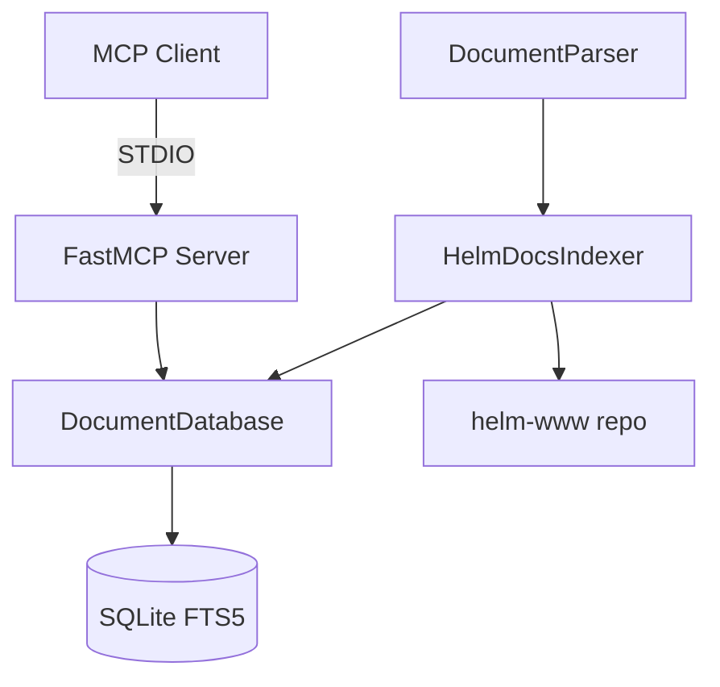

# Claude Code Instructions

This file provides context for Claude Code when working with this project.

## Project Overview

This is an MCP (Model Context Protocol) server for Helm documentation. It provides
two tools:

1. `search_documentation` - Full-text search of Helm docs using SQLite FTS5
2. `read_documentation` - Retrieve full content of a documentation page

## Architecture



## Key Files

| File | Purpose |
|------|---------|
| `src/mcp_helm_documentation/server.py` | FastMCP server with tool definitions |
| `src/mcp_helm_documentation/database.py` | SQLite FTS5 operations |
| `src/mcp_helm_documentation/parser.py` | Markdown frontmatter parser |
| `src/mcp_helm_documentation/indexer.py` | Clone and index helm-www |
| `src/mcp_helm_documentation/cli.py` | CLI for indexing commands |

## Common Commands

```bash
# Initialise development environment
make init

# Run tests with coverage
make test

# Run full build (lint + typecheck + test)
make build

# Format code
make format

# Build documentation index
make index

# Run MCP server
make run
```

## Development Notes

- Python 3.12+ required
- Uses uv for package management
- Ruff for linting/formatting
- mypy for type checking
- pytest for testing

## Data Flow

1. **Indexing**: Clone helm-www → Parse markdown → Store in SQLite FTS5
2. **Search**: Query → FTS5 MATCH → BM25 ranking → Return results
3. **Read**: Path → Database lookup → Return document content

## Dependencies

- `fastmcp` - High-level MCP server framework
- `python-frontmatter` - Parse YAML frontmatter from markdown

## Testing

Tests use pytest with fixtures defined in `tests/conftest.py`. Database tests use
temporary directories to avoid polluting the development database.

```bash
# Run specific test file
uv run pytest tests/test_database.py -v

# Run with coverage report
uv run pytest --cov=src/mcp_helm_documentation
```
